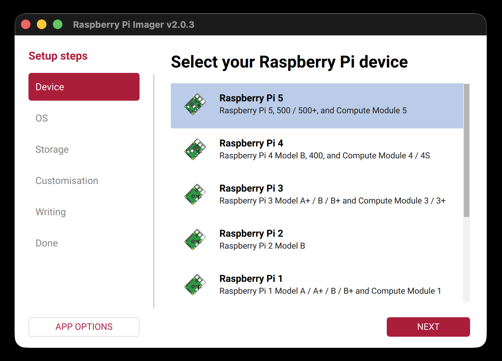

+++
title = "ZACLOG/01.01 - Hello, ZAC! (Part One)"
date = 2026-01-12T22:58:00+00:00
draft = false
tags = ['zaclog', 'phase-01', 'raspberry-pi', 'nodejs', 'react', 'express', 'vite', 'hardware', 'software']
overview = 'Phase 01 begins. Setting up the Raspberry Pi with remote access and a basic web stack.'
+++


## Contents

* [Overview](#overview)
* [Goals](#goals)
* [Inventory](#inventory)
* [Walkthrough](#walkthrough)
* [Summary](#summary)
* [Next](#next)

---

## Overview

Welcome to Phase 01 of the [ZAC](/glossary/zac) project. 

This is where it all begins, so if you don't know your ass from your elbow, don't worry, you're in the right place.

The goal of Phase 01 is to build a proof of concept (POC) — a small, working version of ZAC that shows us how all the hardware and software pieces fit together. It also lets us sanity-check the whole idea, because the jury's still out on that one.

Phase 01 is a two-parter. This is Part One. A nice and easy introduction.

Good luck, amigo.

---

Journal: [The Micro Center at Crescent Hills](/journal/the-micro-center-at-crescent-hills)

---

## Goals

By the end of Part One, we're gonna have:

- A running Raspberry Pi
- Remote access via VNC and SSH
- A Node.js API serving "Hello, ZAC!"
- A React app displaying it in the browser

---

## Inventory

### Equipment
- Raspberry Pi - Raspberry Pi 5 8GB (SC1112)
- MicroSD card - SanDisk 32GB Ultra microSDHC 120MB/s A1 Class 10 UHS-I (SDSQUA4-032G-GN6MN)
- Power supply - RasTech Pi 5 Power Supply (XS-GaN-27W)
- Monitor - ELECROW 10.1 Inch Portable Monitor (602914362078)
- Keyboard - Logitech K400 Plus Wireless Keyboard (920-007119)

### Tools
- Another computer on same network - Macbook Pro 16-inch, Nov 2023
- MicroSD card reader - Macbook Pro 16-inch, Nov 2023 (and SD card adapter for MicroSD)

---

## Walkthrough

### 1. Flash the microSD Card

This step happens on your dev computer (not the Raspberry Pi).

You need a microSD card of at least 16GB. Raspberry Pi Imager is an official tool that writes (or "flashes") the Raspberry Pi OS onto your microSD card so the Pi can boot from it.

Download and install [Raspberry Pi Imager](https://www.raspberrypi.com/software/) on your dev computer.

Insert your microSD card into your dev computer (using an SD card adapter if needed), then run the Imager tool.

**Tip:** If you're using an SD card adapter, make sure it's not in read-only mode — there's usually a small slider on the side that needs to be pushed towards the contacts.

1. For the device, select your Raspberry Pi model (Raspberry Pi 5)
2. For the operating system, select **Raspberry Pi OS (64-bit)** — this is the Desktop version, which we need for VNC later. The Imager will download it for you. (You can also download it manually from the [Raspberry Pi OS page](https://www.raspberrypi.com/software/operating-systems/) if you prefer, but letting the Imager handle it is easier.)
3. For storage, select your microSD card
4. Click **Next**. You'll see a popup asking "Would you like to apply OS customisation settings?" — click **No** for now (we'll configure everything after boot). Then click **Yes** to confirm and flash it

<a href="rp-imager.png" target="_blank"></a>

---

### 2. Boot the Raspberry Pi

Now we move to the Raspberry Pi itself. Hook everything up and power it on:

<a href="rp-hardware.png" target="_blank"></a>

1. Connect the monitor to the RPI5 — HDMI end into the monitor, miniHDMI end into the RPI5
2. Connect the keyboard to the RPI5 via USB
3. Insert the freshly flashed microSD card into the RPI5
4. Plug the power supply into the RPI5 and into a wall outlet to power it on
5. The Pi will boot into the Raspberry Pi OS setup wizard — follow the prompts to select your language, timezone, create a user account, and connect to your Wi-Fi network

**Important:** Write down the username and password you create during this step. You'll need them for SSH and VNC later.

<a href="rp-os-setup.png" target="_blank"></a>

---

### 3. Find Your Raspberry Pi's IP Address

Before we can connect to the Pi remotely, we need to know its IP address on the local network. You'll need this for both SSH and VNC in the next steps.

Open a terminal on your Raspberry Pi. You can find it in the taskbar at the top of the screen (look for the black rectangle icon), or right-click the desktop and select "Open Terminal". Then run:

```bash
nmcli device show
```

This command lists every network interface on your Pi. You'll see a lot of output — don't worry, you only need one piece of information from it: the `IP4.ADDRESS[1]` field from the block that matches your network connection.

Here's how to find it:

1. The output is split into blocks, one per network interface. Each block has a `GENERAL.TYPE` row that tells you what kind of interface it is — `wifi`, `ethernet`, `loopback`, etc.
2. Find the block that matches how your Pi connects to the internet — `wifi` if you're on Wi-Fi, or `ethernet` if you're using a cable.
3. In that block, look for the `IP4.ADDRESS[1]` field — that's your IP address. Ignore the trailing slash and number (e.g. the `/24` part).

Here's an example. This Pi is on Wi-Fi, so we look at the block where `GENERAL.TYPE` is `wifi` and find `IP4.ADDRESS[1]: 192.168.1.42/24` — making the IP address `192.168.1.42`:

```text
GENERAL.DEVICE:                         wlan0
GENERAL.TYPE:                           wifi
GENERAL.HWADDR:                         D0:3B:FF:41:AB:8A
GENERAL.MTU:                            1500
GENERAL.STATE:                          100 (connected)
GENERAL.CONNECTION:                     exampleNetworkName
GENERAL.CON-PATH:                       /org/freedesktop/NetworkManager/ActiveConnection/2
IP4.ADDRESS[1]:                         192.168.1.42/24
IP4.GATEWAY:                            192.168.1.1
IP4.ROUTE[1]:                           dst = 192.168.1.0/24, nh = 0.0.0.0, mt = 600
IP4.ROUTE[2]:                           dst = 0.0.0.0/0, nh = 192.168.1.1, mt = 600
IP4.DNS[1]:                             192.168.1.3
IP6.ADDRESS[1]:                         ab80::11ab:b1fc:bb7e:a8a5/64
IP6.GATEWAY:                            --
IP6.ROUTE[1]:                           dst = ab80::/64, nh = ::, mt = 1024

GENERAL.DEVICE:                         lo
GENERAL.TYPE:                           loopback
GENERAL.HWADDR:                         00:00:00:00:00:00
GENERAL.MTU:                            65536
GENERAL.STATE:                          100 (connected (externally))
GENERAL.CONNECTION:                     lo
GENERAL.CON-PATH:                       /org/freedesktop/NetworkManager/ActiveConnection/1
IP4.ADDRESS[1]:                         127.0.0.1/8
IP4.GATEWAY:                            --
IP6.ADDRESS[1]:                         ::1/128
IP6.GATEWAY:                            --

GENERAL.DEVICE:                         p2p-dev-wlan0
GENERAL.TYPE:                           wifi-p2p
GENERAL.HWADDR:                         (unknown)
GENERAL.MTU:                            0
GENERAL.STATE:                          30 (disconnected)
GENERAL.CONNECTION:                     --
GENERAL.CON-PATH:                       --

GENERAL.DEVICE:                         eth0
GENERAL.TYPE:                           ethernet
GENERAL.HWADDR:                         D0:3B:FF:41:AB:89
GENERAL.MTU:                            1500
GENERAL.STATE:                          20 (unavailable)
GENERAL.CONNECTION:                     --
GENERAL.CON-PATH:                       --
WIRED-PROPERTIES.CARRIER:               off
IP4.GATEWAY:                            --
IP6.GATEWAY:                            --
```

---

### 4. Enable SSH

SSH (Secure Shell) lets you open a terminal session on the Raspberry Pi from your dev computer over the network — no monitor or keyboard needed.

The easiest way to enable it is from the Raspberry Pi desktop:

1. Click the Raspberry Pi icon in the top left corner of the screen to open the main menu, then navigate to Preferences and launch Control Centre.
2. Navigate to the Interfaces tab.
3. Toggle the radio button next to SSH into the active position.
4. Click OK to save your configuration changes.

<a href="rp-control-centre.png" target="_blank"></a>

#### Other ways to enable SSH

> If you already enabled SSH through Control Centre above, skip ahead to [Step 5](#5-enable-vnc). These alternatives are just here for reference.

**From Imager Tool (during Step 1, before booting the Pi):**

1. In the Customisation > Remote Access tab, toggle the Enable SSH switch to the active position.
2. Select **Use password authentication** to log in using the same username and password you use while physically using your Raspberry Pi.
3. OR, Select **Use public key authentication** to configure an SSH key for login with SSH key-based authentication.

**From Raspberry Pi OS Terminal:**

1. Open a terminal on the Raspberry Pi and enter `sudo raspi-config`.
2. Select Interface Options.
3. Navigate to and select SSH.
4. Choose Yes.
5. Select Ok.
6. Choose Finish.

<a href="rp-raspi-config.png" target="_blank"></a>

**Manually:**

Create an empty file named `ssh` in the boot partition. Open a terminal on the Raspberry Pi and run:

```bash
sudo touch /boot/firmware/ssh
```

Reboot the machine:

```bash
sudo reboot
```

---

### 5. Enable VNC

VNC (Virtual Network Computing) lets you see and control the Raspberry Pi's full graphical desktop from your dev computer — like remote desktop. This is useful when you need more than just a terminal.

The easiest way to enable it is from the same Control Centre you used in Step 4:

1. Click the Raspberry Pi icon in the top left corner of the screen to open the main menu, then navigate to Preferences and launch Control Centre.
2. Navigate to the Interfaces tab.
3. Toggle the radio button next to VNC into the active position.
4. Click OK to save your configuration changes.

<a href="rp-control-centre.png" target="_blank"></a>

#### Other ways to enable VNC

> If you already enabled VNC through Control Centre above, skip ahead to [Step 6](#6-connect-to-the-raspberry-pi-remotely). This alternative is just here for reference.

**From Raspberry Pi OS Terminal:**

1. Open a terminal on the Raspberry Pi and run: `sudo raspi-config`
2. Navigate to Interface Options. Press Enter to select.
3. Select VNC. Press Enter to select.
4. Under "Would you like the VNC Server to be enabled?", highlight \<Yes\> and press Enter.
5. Press Enter to return to the menu. Press Esc to exit raspi-config.

---

### 6. Connect to the Raspberry Pi Remotely

Now that SSH and VNC are enabled, we can ditch the monitor and keyboard and control the Pi entirely from the dev computer. This is how we'll be working with the Pi from here on out.

**Important:** Make sure both your dev computer and the Raspberry Pi are connected to the same Wi-Fi network. If they're on different networks, they won't be able to see each other.

Everything in this step happens on your dev computer. You'll need to open a terminal:

* **macOS:** Open Terminal (search for "Terminal" in Spotlight, or find it in Applications > Utilities)
* **Windows:** Open PowerShell (search for "PowerShell" in the Start menu)
* **Linux:** Open your terminal emulator (usually Ctrl+Alt+T, or find it in your application menu)

#### Connect via SSH

In your dev computer's terminal, run the following command. Replace `<username>` with the user account you created during OS setup, and `<ip address>` with the IP address from Step 3:

```bash
ssh <username>@<ip address>
```

For example:

```bash
ssh zac@192.168.1.42
```

The first time you connect, you'll see a message asking you to confirm the host's authenticity — type `yes` and press Enter. Then enter your password when prompted. **Note:** your password won't show on screen as you type — no dots, no asterisks, nothing. That's normal. Just type it and press Enter.

You should now have a terminal session running on the Raspberry Pi. You can run commands as if you were sitting in front of it. Type `exit` to disconnect.

#### Connect via VNC

Download and install [RealVNC Viewer](https://www.realvnc.com/en/connect/download/viewer/) for your platform:

* **macOS:** Download the `.dmg`, open it, and drag VNC Viewer into your Applications folder. Launch it from Applications or Spotlight.
* **Windows:** Download the `.exe` installer and run it. Launch VNC Viewer from the Start menu.
* **Linux:** Download the `.deb` or `.rpm` package and install it with your package manager (e.g. `sudo dpkg -i VNC-Viewer-*.deb` on Debian/Ubuntu or `sudo rpm -i VNC-Viewer-*.rpm` on Fedora/RHEL). Launch it from your application menu or by running `vncviewer` in a terminal.

Once installed:

1. Open VNC Viewer on your dev computer
2. Enter the IP address from Step 3 (e.g. `192.168.1.42`) and hit Connect
3. Enter the username and password you created during OS setup
4. You should see the Raspberry Pi's full desktop in a window on your dev computer

<a href="macos-vnc-viewer.png" target="_blank"></a>

You now have both a terminal (SSH) and a graphical desktop (VNC) connection to the Pi, all over the network. The monitor and keyboard can be disconnected from the RPI5 — you won't need them anymore.

---

### 7. Install Node.js

From here on, we're working on the Raspberry Pi via SSH. Open a terminal on your dev computer and connect to the Pi:

```bash
ssh <username>@<ip address>
```

First, make sure the system packages are up to date:

```bash
sudo apt update && sudo apt upgrade -y
```

Then install Node.js and npm:

```bash
sudo apt install nodejs npm -y
```

Verify they installed correctly:

```bash
node --version
npm --version
```

You should see version numbers printed for both. Node should be v18 or higher.

---

### 8. Clone and Run ZAC

Still on the Pi via SSH. Clone the ZAC repository:

```bash
git clone --branch zaclog/01.01 https://github.com/ZombieApocalypseTech/zac.git
```

This grabs a specific version of the code that matches this walkthrough. Move into the project directory:

```bash
cd zac
```

The project has two parts — a **server** (Node.js + Express API) and a **client** (React + Vite frontend). Install the dependencies for both:

```bash
npm run install:all
```

This will take a minute or two. Once it's done, start everything up:

```bash
npm run dev
```

You should see output indicating both the server and client are running. The API runs on port 3000 and the React dev server runs on port 5173.

Now open the Raspberry Pi's desktop via VNC (from Step 6). Open the Chromium browser on the Pi and go to:

```text
http://localhost:5173
```

<a href="rp-hello-zac.png" target="_blank"></a>

You should see **"Hello from ZAC"** displayed in the browser. That's the React app fetching from the Express API and rendering the response.

Here's what's happening under the hood:

1. The Express server (`server/index.js`) has an endpoint at `/api/hello` that returns `{ message: "Hello from ZAC" }`
2. The React app (`client/src/App.jsx`) fetches from `/api/hello` when it loads and displays the message
3. Vite's dev server proxies any request starting with `/api` to the Express server on port 3000, so the React app doesn't need to know the server's port

To stop everything, press `Ctrl+C` in the SSH terminal where you ran `npm run dev`.

---

### Troubleshooting

**The Pi won't boot / no display:**

* Make sure the microSD card is fully inserted — it should click into place.
* Try re-flashing the microSD card. A bad flash is the most common cause.
* Double-check the monitor cable — miniHDMI end goes into the Pi, HDMI end into the monitor. The RPI5 has two miniHDMI ports; try the one closest to the USB-C power port.
* Make sure the power supply provides enough power. The RPI5 needs at least 5V/5A (25W). An underpowered supply can cause boot failures or random crashes.

**SSH says "Connection refused":**

* SSH isn't enabled yet. Go back to Step 4 and enable it.
* Double-check the IP address — it may have changed. Re-run `nmcli device show` on the Pi to confirm.

**SSH says "No route to host" or "Connection timed out":**

* Your dev computer and the Pi aren't on the same network. Make sure both are connected to the same Wi-Fi network.
* The IP address may be wrong. Re-run `nmcli device show` on the Pi.

**VNC shows a black screen or won't connect:**

* Make sure VNC is enabled on the Pi (Step 5).
* If you see a black screen, the Pi may be set to a resolution your VNC client can't handle. Connect via SSH and run `sudo raspi-config`, then go to Display Options > VNC Resolution and pick a standard resolution like 1280x720.
* Make sure both devices are on the same network.

**"Permission denied" when using SSH or VNC:**

* Double-check your username and password — these are the credentials you created during the Raspberry Pi OS setup wizard in Step 2.

**`npm run install:all` or `npm run dev` fails:**

* Make sure you're in the `zac` directory (run `pwd` to check — it should end with `/zac`).
* If you see "command not found" errors for `node` or `npm`, go back to Step 7 and install them.
* If you see permission errors, don't use `sudo` with npm commands — run them as your normal user.

**Browser shows "Loading..." or "Error":**

* Make sure both the server and client are running — you should see output from both in the terminal where you ran `npm run dev`.
* Make sure you're visiting `http://localhost:5173`, not port 3000.
* Try refreshing the page — the server might not have been ready when the page first loaded.

---

## Summary

Let's check our work against the goals:

* **A running Raspberry Pi** — Flashed the microSD card, booted into Raspberry Pi OS, and got through the setup wizard.
* **Remote access via VNC and SSH** — Enabled both, connected from the dev computer, and ditched the monitor and keyboard.
* **A Node.js API serving "Hello, ZAC!"** — Installed Node.js, cloned the repo, and got Express running on port 3000 with `/api/hello`.
* **A React app displaying it in the browser** — Vite serves the React frontend, which fetches from the API and renders "Hello from ZAC" in Chromium.

That's a Raspberry Pi running a full web stack, controlled entirely from another computer over the network. Not bad for Part One.

---

## Next

Quick mention of what we'll be moving into next, plus link when it exists.